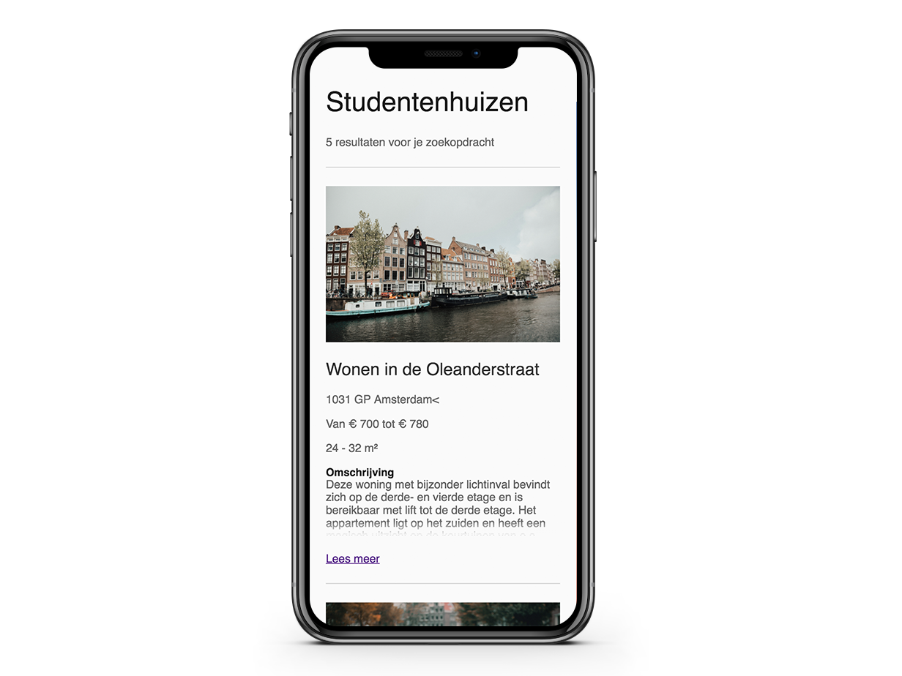

# Frontend voor Designers - Opdracht 1 - Lucas Berghoef

In deze eerste opdracht van Frontend voor Designers heb ik een user interface ontworpen
voor usercase 2 'In een lijst gevonden studentenhuizen wil ik details kunnen bekijken om te bepalen of de kamer geschikt is.'
Deze heb ik uitgewerkt in HTML, CSS en Javascript om te kunnen testen in Chrome voor de iPhone X.

Hierbij heb ik de volgende voorbeelden gebruikt:
* Demo van uitkappende zoekbalk wanneer er op vergrootglas wordt geklikt: https://codepen.io/KoopReynders/pen/KdEagB?editors=0010
* Priciples 4 & 11 van User Interface Design: https://codepen.io/KoopReynders/pen/KdEagB?editors=0010

# Functies

* [`document.querySelector()`](https://developer.mozilla.org/nl/docs/Web/API/Document/querySelector)- Geeft het eerste element in het document dat overeenkomt met de opgegeven selector, of groep van selectors, of null als er geen overeenkomsten zijn gevonden.
* [`.addEventListener('click', handleClick)`](https://developer.mozilla.org/en-US/docs/Web/API/EventListener)- The EventListener interface represents an object that can handle an event dispatched by an EventTarget object.

# Mijn proces

Na het ontvangen van de opdracht ben ik begonnen met de Html te schrijven. Ik heb gekozen voor het maken van de website voor de iPhone X en deze test ik in de Chrome browser.

## 1. Opzetten site
Na het bekijken van de voorbeelden op Moodle heb ik de javascript opgezet met een querySelectorom een element in mijn html te selecteren. Vervolgens heb ik daar een eventListener aan gekoppeld die een click detecteerd en daar vervolgens de actie op uit te voeren.

## 2. Aanpassingen na testen eerste versie
Na het laten testen van mijn [eerste versie](https://github.com/lucasberghoef/Frontend-voor-Designers/tree/master/Opdracht%201/V1) door een vriend (die geen CMD studeerd), was het al snel duidelijk dat hij de opdracht die ik hem gaf niet geheel begreep doordat er nog Lorem Ipsum stond in deze versie. Ik vroeg hem om de 'omschrijving' uit te klappen en hiermee de gehele omschrijving te tonen. Ook was er hierbij nog geen kopje 'omschrijving'. Dus in de tweede versie heb ik het lorem ipsum vervangen en een kopje 'omschrijving' toegevoegd.

## 3. Aanpassingen na testen tweede versie
Bij het testen van de [tweede versie](https://github.com/lucasberghoef/Frontend-voor-Designers/tree/master/Opdracht%201/V2) was deze onduidelijkheid opgelost. Ook de neutralere kleuren bevielen beter. Echter ontstond er nog onduidelijkheid bij de tekst 'Sluit' die ontstaat nadat de omschrijving was uitgeklapt. Vandaar de keuze om in de derde versie deze 'Sluit' tekst te vervangen met de tekst 'Lees minder'

# To Do

* 1. Toevoegen animatie bij 'uitschuiven' van de 'Lees meer' knop.

# License

MIT © Lucas Berghoef
