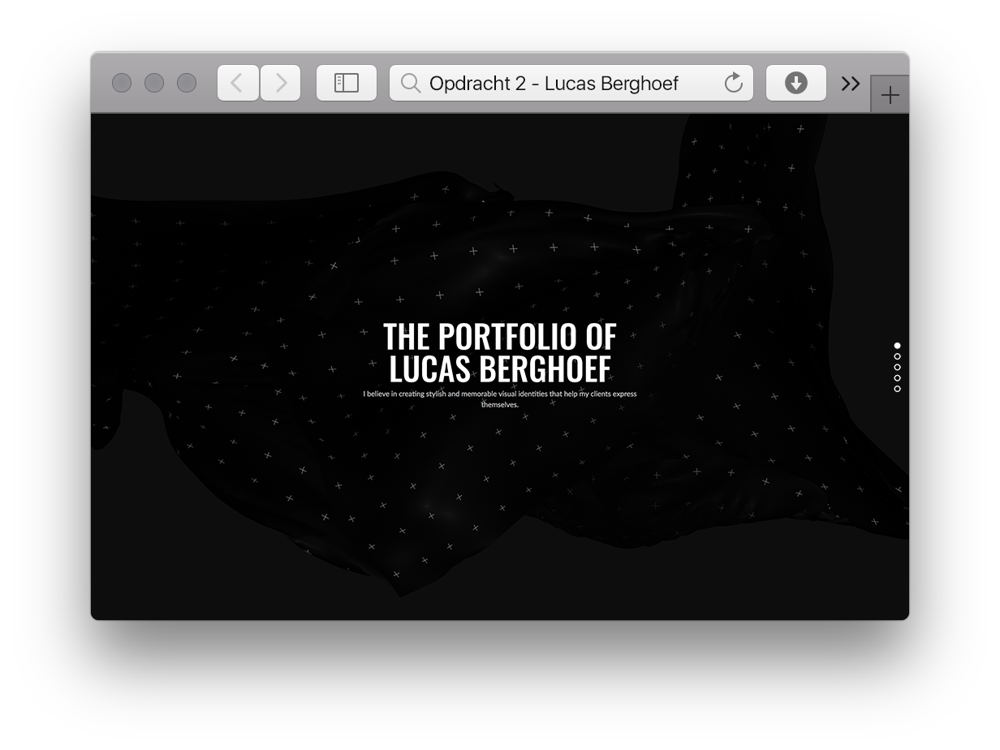

# Frontend voor Designers - Opdracht 2 - Lucas Berghoef

In deze tweede opdracht van Frontend voor Designers heb ik een user interface ontworpen voor usercase 2
'Portfolio website met 5 beeldvullende sections met projecten en een biografie, als je naar 'beneden' scrollt vult de betreffende section zicht met informatie. Als je op toetsen klikt ga je ook naar de volgende section'.
Deze heb ik uitgewerkt in HTML, CSS en Javascript om te kunnen testen in Safari voor desktop.

Hierbij heb ik de volgende voorbeelden gebruikt:
* Self invoking function:  https://sarfraznawaz.wordpress.com/2012/01/26/javascript-self-invoking-functions/
* Event listeners (passive): https://developer.mozilla.org/en-US/docs/Web/API/EventTarget/addEventListener
* Scroll event: https://developer.mozilla.org/en-US/docs/Web/Events/wheel
* Javascript indicators:  https://stackoverflow.com/questions/12622465/creating-a-div-element-inside-a-div-element-in-javascript

* Principles van User Interface Design: https://codepen.io/KoopReynders/pen/KdEagB?editors=0010

# Functies

* [`document.querySelector()`](https://developer.mozilla.org/nl/docs/Web/API/Document/querySelector)- Geeft het eerste element in het document dat overeenkomt met de opgegeven selector, of groep van selectors, of null als er geen overeenkomsten zijn gevonden.
* [`.addEventListener('click', handleClick)`](https://developer.mozilla.org/en-US/docs/Web/API/EventListener)- The EventListener interface represents an object that can handle an event dispatched by an EventTarget object.

# Mijn proces

Na het ontvangen van de opdracht ben ik begonnen met de Html te schrijven. Ik heb gekozen voor het maken van de website voor desktop en deze test ik in Safari.

## 1. Opzetten html en css
Ik ben begonnen met het opzetten van de Html elementen om deze vervolgens met CSS te stylen, op deze manier had ik alvast een [eerste versie](https://github.com/lucasberghoef/Frontend-voor-Designers/tree/master/Opdracht%202/V1) met de 5 full-screen secties waarop ik de javascript kon gaan toepassen.

## 2. Scroll hijacking
Vervolgens heb ik in de [tweede versie](https://github.com/lucasberghoef/Frontend-voor-Designers/tree/master/Opdracht%202/V2) met `overflow: hidden;` er voor gezorgd dat je niet zelf door de content heen kan scrollen. Daarna heb ik een Event Listener aangemaakt die controleerd of de gebruiker zijn scrollwheel gebruikt. In het geval dat dit gebeurt wordt de richting gecontroleerd. Dan wordt er gekeken of hij die kant op mag bewegen afhankelijk van de huidige positie. Vervolgens wordt de CSS top positie van de container veranderd om de volgende of vorige sectie weer te geven.

## 3. Buttons toevoegen
In de [derde versie](https://github.com/lucasberghoef/Frontend-voor-Designers/tree/master/Opdracht%202/V3) heb ik twee buttons toegevoegd. Ik koos ervoor om containers om deze buttons heen te plaatsen, waardoor de buttons zichtbaar konden worden zodra de cursor in de buurt van de button komt. Zodra er op een button wordt geklikt wordt ongeveer dezelfde functie uitgevoerd als bij het scrollen. Uitzondering is dat de richting wordt aangegeven via een data attribuut op de button i.p.v. gabaseerd op een waarde uit het event zelf (scroll richting). Buttons worden daarnaast verborgen als je niet verder of terug meer kan klikken.

## 4. Keydown Event Listener
Daarna ben ik in de [vierde versie](https://github.com/lucasberghoef/Frontend-voor-Designers/tree/master/Opdracht%202/V4) aan de slag gegaan om ook de toetsfuncties te laten werken. Ik wilde ervoor zorgen dat de rechts en beneden toetsen ervoor zorgen dat de volgende sectie wordt getoond en de links en boven toetsen de vorige sectie weergeven. Hiervoor heb ik een Event Listener aangemaakt die een fucntie met switch gebruikt. Ik heb voor een switch gekozen omdat meerdere toetsen de zelfde functie aanroepen. Dit vond ik leesbaarder.

## 5. Position idicators en animatie
Bij de [vijfde versie](https://github.com/lucasberghoef/Frontend-voor-Designers/tree/master/Opdracht%202/V5) heb ik een position indicator gemaakt nadat een mede student aangaf dat hij dit nog misde in mijn website. De indicators worden aangemaakt gebaseerd op de hoeveelheid secties. De eerste indicator krijgt alvast een `active` class zodat deze wel direct de juiste stijl heeft. Vervolgens wordt na elke animatie opnieuw bepaald welke indicator actief moet zijn. Van alle niet-actieve wordt de `active` class weer verwijderd.

Om de content te animeren zodra een sectie wordt getoond, wordt de sectie ook voorzien van een `active` class. Deze class start een transitie om de onderliggende content, waarna deze van opacity veranderd en naar boven beweegt via een `transform`.

## 6. Laatste styling
Met de [zesde versie](https://github.com/lucasberghoef/Frontend-voor-Designers/tree/master/Opdracht%202/V6) heb ik nog de nodige styling toegepast waaronder het gebruik van Google Fonts en het toevoegen van mijn eigen werk in plaats van de placeholder afbeeldingen die ik daarvoor gebruikte.

# To do

* De position indicator klikbaar maken.

# License

MIT © Lucas Berghoef
