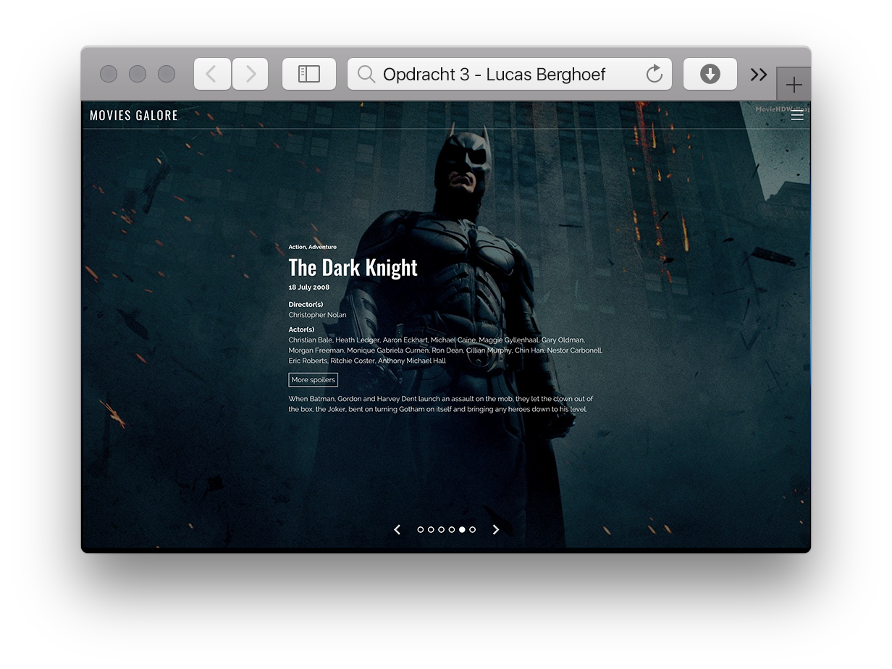

# Frontend voor Designers - Opdracht 3 - Lucas Berghoef

In deze derde opdracht van Frontend voor Designers heb ik een user interface ontworpen.

Hierbij heb ik de volgende voorbeelden gebruikt:
* Self invoking function:  https://sarfraznawaz.wordpress.com/2012/01/26/javascript-self-invoking-functions/
* Event listeners (passive): https://developer.mozilla.org/en-US/docs/Web/API/EventTarget/addEventListener
* Scroll event: https://developer.mozilla.org/en-US/docs/Web/Events/wheel
* Javascript indicators:  https://stackoverflow.com/questions/12622465/creating-a-div-element-inside-a-div-element-in-javascript

* Principles van User Interface Design: https://codepen.io/KoopReynders/pen/KdEagB?editors=0010

# Functies

* [`document.querySelector()`](https://developer.mozilla.org/nl/docs/Web/API/Document/querySelector)- Geeft het eerste element in het document dat overeenkomt met de opgegeven selector, of groep van selectors, of null als er geen overeenkomsten zijn gevonden.
* [`.addEventListener('click', handleClick)`](https://developer.mozilla.org/en-US/docs/Web/API/EventListener)- The EventListener interface represents an object that can handle an event dispatched by an EventTarget object.

# Mijn proces

Na het ontvangen van de opdracht ben ik begonnen met de Html te schrijven. Ik heb gekozen voor het maken van de website voor desktop en deze test ik in Safari.

## 1. Het begin
Ik ben begonnen met...

# To do

* De position indicator klikbaar maken.

# License

MIT © Lucas Berghoef
